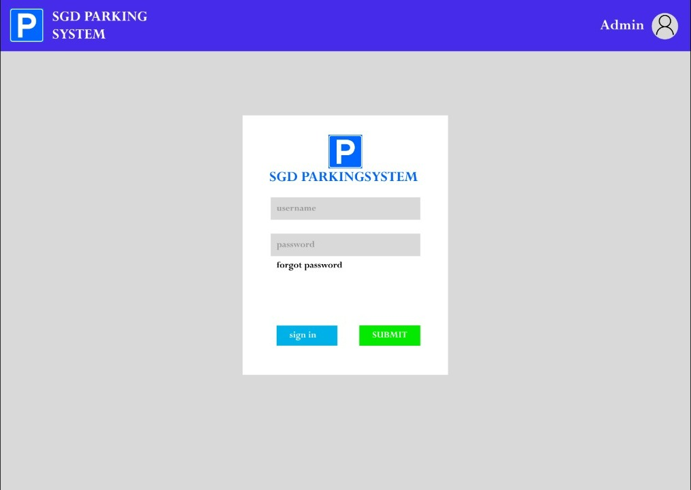
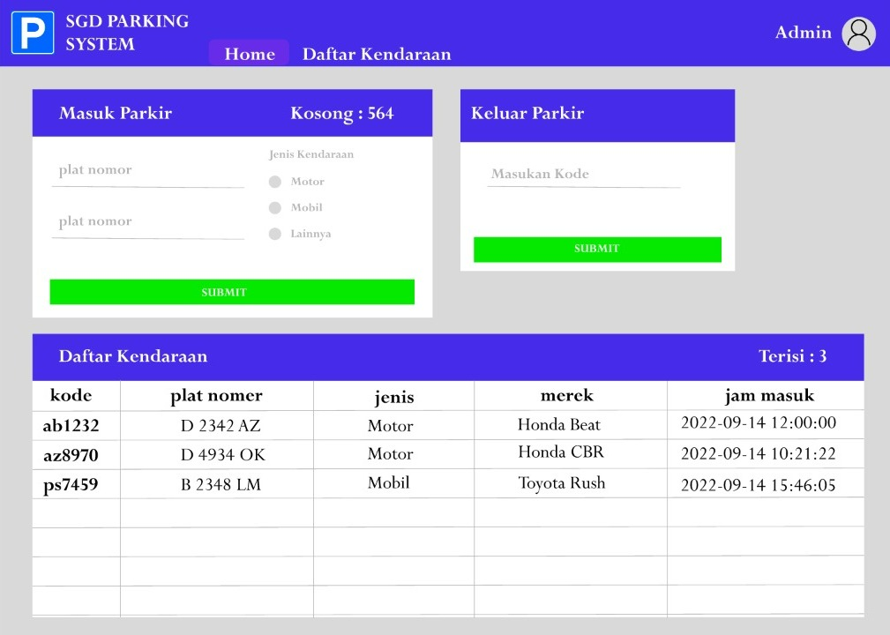
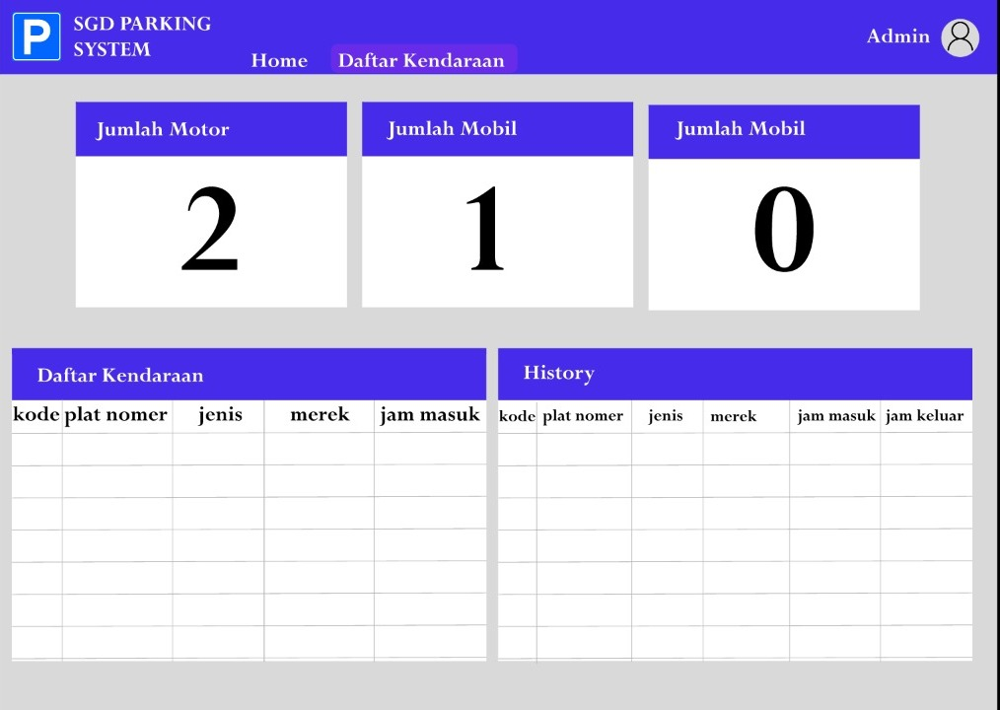

<h1> PROPOSAL APLIKASI </h1>
<h2>Permasalahan</h2>
<li>Kondisi parkiran di lahan parkir UIN Sunan Gunung Djati Bandung yang tidak terkoordinir dengan baik dan lahan yang terbatas.</li>
<h2>Rancangan Solusi</h2>
<li>Membuat aplikasi yang dapat menghitung jumlah kendaraan yang parkir di UIN SGD Bandung</li>
<li>Aplikasi dapat memberi tahu jumlah lahan parkir yang tersisa</li>
<h2>Use Case</h2>
<li>User dapat memasukan Nomor Polisi untuk mendapatkan lahan parkir yang sudah ditentukan sistem</li>
<li>User dapat melihat sisa kuota lahan parkir yang tersisa</li>
<li>Admin dapat melihat naik turunnya statistik jumlah parkir tiap harinya</li>
<h2>Struktur Data</h2>
<h3>User</h3>
<table>
<tr>
    <th>Atribut</th>
    <th>Tipe Data</th>
    <th>Contoh</th>
  </tr>
  <tr>
    <td>Kode</td>
    <td>String</td>
    <td>ab1232</td>
  </tr>
    <tr>
    <td>Plat Nomer</td>
    <td>String</td>
    <td>BG 1 HH</td>
  </tr>
    <tr>
    <td>Jenis</td>
    <td>String</td>
    <td>Motor</td>
  </tr>
    <tr>
    <td>Merek</td>
    <td>String</td>
    <td>Honda Beat</td>
  </tr>
    <tr>
    <td>Jam Masuk</td>
    <td>Timestamp</td>
    <td>2022-09-14 12:00:00</td>
  </tr>
    <tr>
    <td>Jam Keluar</td>
    <td>Timestamp</td>
    <td>2022-09-14 14:00:00</td>
  </tr>
</table>
<h2>UX Wireframe</h2>

